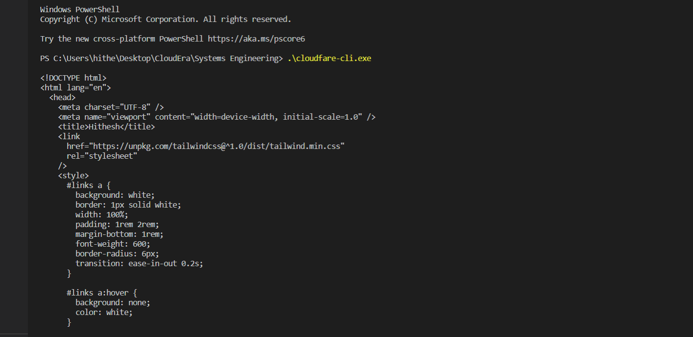
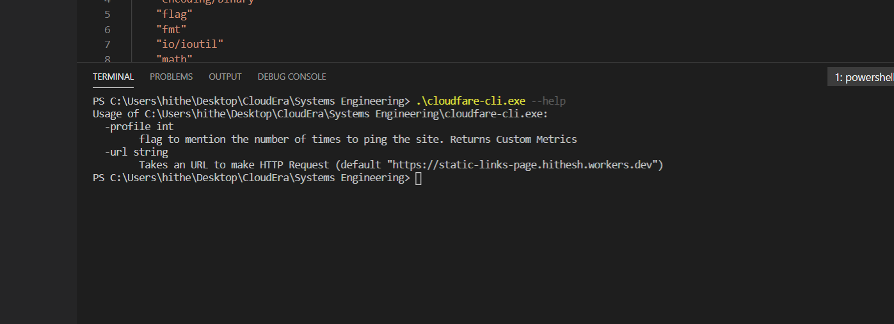
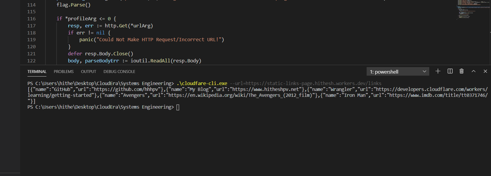
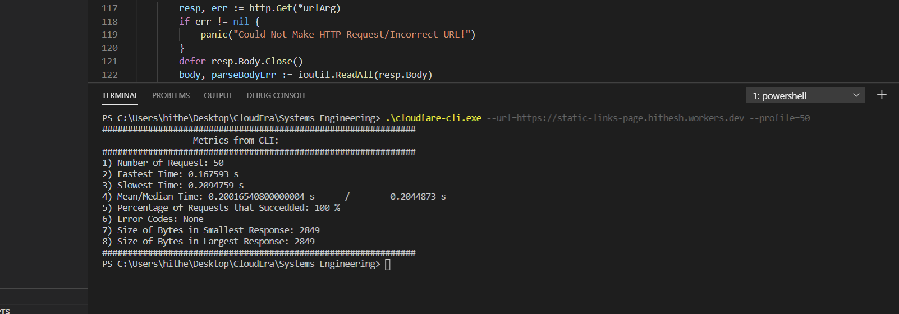
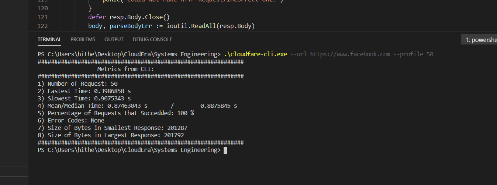
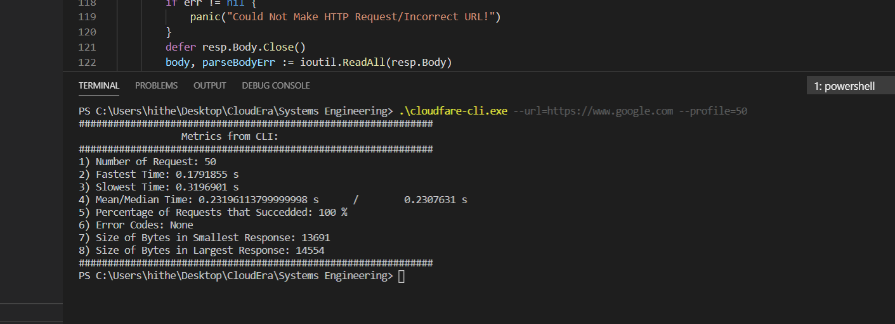
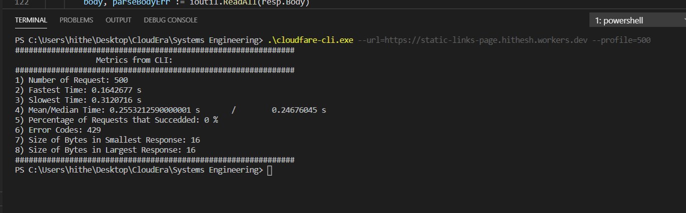

# Cloudfare 2020 Systems Assignment - by Hithesh

## Code submitted as a Zip File on Greenhouse

## Completed Tasks:
- [x] Selected Golang to Complete the task
- [x] Did not use any library and handled the request with custom Dialer.
- [x] Created a CLI tool that has flags --help --profile and --url

### Screen-Shots:

